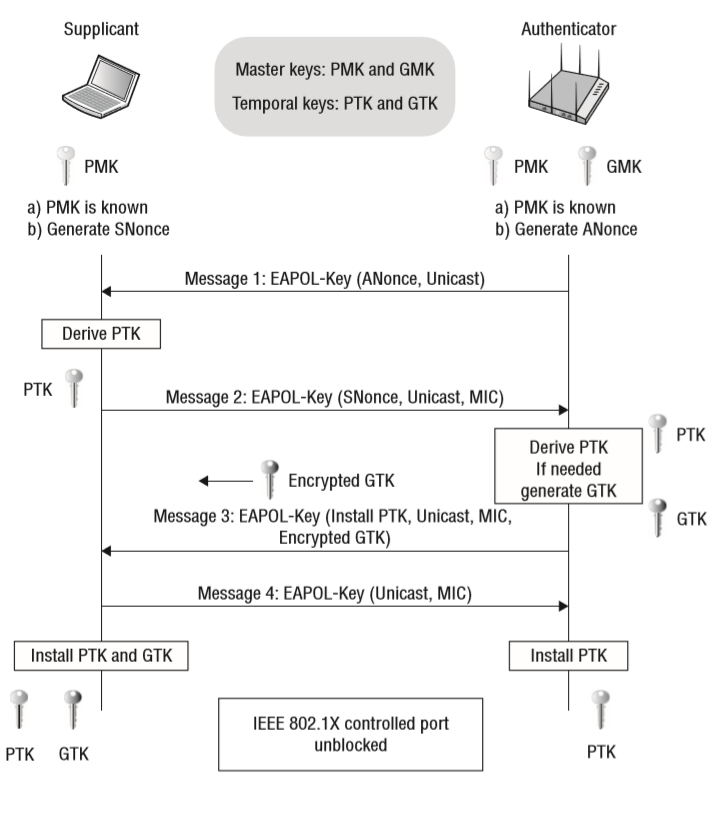

# Work. Apunts Wifi

## Wifi - conceptes generals

La tecnologia wifi és una tecnologia per a la connexió de dispositius sense fil. A nivell físic fa servir les ones electromagnètiques com a mitjà de transmissió i actua en la capa 1 del model TCP/IP a partir dels estàndars IEEE 802.11, els quals permeten la creació de xarxes WLAN.

**Conceptes associats a la Wifi**

* SSID - Service set identifier. És el nom que se li assigna a una xarxa wifi que s'anuncia als dispositius inalàmbrics que hi han al voltant.

* Estació - Dispositiu inalàmbric.

* Punt d'accés: Fa de pont entre la xarxa wireless i la cablejada i possibilita l'accés a la xarxa dels dispositus inalàmbrics.

## Paràmetres físics relacionats amb la tecnologia wifi

* **Banda de freqüència** - és el rang de freqüència en el que actuen les ones wifi en una mateixa xarxa. A major freqüència, major velocitat de dades però menor abast. A Wifi trobem les següents bandes: 2.4 GHz, 5 GHz i 6 GHz.

* **Canal** - Les xarxes wifi que actuen en una mateixa banda, han de compartir aquest rang de freqüència, per la qual cosa es divideix la banda en una sèrie de canals i les xarxes wifi que actuen molt a prop han d'emetre en canals diferents per a evitar interferències. 

Els Canals a 2.4 GHz:

[Wikipedia. Canals wifi en diferents bandes de feqüència](https://en.wikipedia.org/wiki/List_of_WLAN_channels)

### Estudi de cobertura

[Estudi de cobertura wifi - pàg 49](https://openaccess.uoc.edu/bitstream/10609/118426/7/inavidadTFM0620memoria.pdf)

Bàsicament, la cobertura wifi és l'àrea on arriba la senyal d'una xarxa wifi. Quins factors determinen la cobertura? Alguns poden ser la banda de freqüència en la que actua, el canal, els obstacles físics, i l'atenuació o la força de la senyal.

* Força de la senyal: mesurat en decibel·lis (dBM). A major senyal, millor rendiment.
* Obstacles físics: Els obstacles físics poden disminuir la força de la senyal (parets, sostres, terra, mobles, etc).
* Interferències, per exemple, amb altres xarxes wifi. En aquest punt és important l'el·lecció del canal.
* Col·locació dels punts d'accés: Llocs centrals, lliures d'obstacles (situar el PA en llocs elevats)

#### Eines de mapes de calor

NetSpot, Ekahau HeatMapper, Wifi Analyzer (Android), Acrylic Wi-fi Home

## Estandars wifi

[Relació amb estandars 802.11](https://www.wi-fi.org/certification/programs)

1. 802.11a (1999)
2. 802.11b (1999) - 11 Mbps
3. 802.11g (2003) - 54 Mbps
4. 802.11h (2003) - Banda dels 5GHz
5. 802.11i (2004) - WPA2
6. 802.11n (2004) - 650 Mbps
7. 802.11ac (2014) - 1.3Gbps. 3 antenes. Possibilitat de MU-MIMO.
8. 802.11ax (2020) - Banda dels 5GHz. Possibilitat de MU-MIMO.

### 802.11 Wifi MAC header vs 802.3 Ethernet MAC header

## Tecnologies emergents: MU-MIMO, Beamforming

### MU-MIMO

*Multi-User, Multiple Input, Multiple Output*. És una tecnologia avançada en xarxes Wi-Fi que permet a un punt d'accés (AP) comunicar-se amb diversos dispositius de manera simultània, millorant la capacitat, eficiència i rendiment de la xarxa. 

Utilitza múltiples antenes per enviar i rebre diverses transmissions de dades alhora de dos o més dispositius.

**MIMO** permet l'enviament i recepció de dades simultànies, però del mateix dispositiu.

### Beamforming

Permet enfocar la senyal (tradicionalment omnidireccional a wifi) cap els dispositius destinataris i guanyar en abast i qualitat de la senyal.

## Arquitectura wifi

### Xarxa wifi en mode infraestructura 

Hi ha un punt d'accés wifi que actúa com a intermediari per la comunicació entre els dispositius de la xarxa.

### Xarxa wifi en mode ad-hoc
No hi ha cap punt d'accés que centralitza la comunicació. els dispositius es connecten directament.

### Repetidor wifi

Es connecta al punt d'accés principal. No té per què emetre la senyal a la mateixa banda que el punt d'accés principal.

### Sistemes de wifi de xarxa 

#### Wireless distribution system (WDS)

Hi han dos modes: 
1. Un punt d'accés central i la resta són repetidors.
2. Dues xarxes wifi unides per un punt d'accés que fa de pont.

#### En malla

Els diferents punts d'accés es connecten entre ells formant una xarxa en malla. Cada punt d'accés es connecta en cada moment amb el punt d'accés que li vingui millor (segons l'estat de la resta). 

### PLC

a través de la xarxa elèctrica.

### Hotspot

Un hotspot és una ubicació física on es proporciona accés a Internet de manera inalàmbrica a través de Wi-Fi. 

### Xarxes convidades

Una xarxa convidada és una xarxa Wi-Fi separada i aïllada de la xarxa principal, creada perquè els visitants o usuaris externs es connectin a Internet sense accedir a recursos privats o sensibles de la xarxa principal. Així, és una mesura de seguretat per evitar que els dispositius dels convidats comprometin la xarxa interna.

## Seguretat

[Auditoria wifi amb hashcat i Kali Linux](https://youtu.be/paS0w6wQP_g?si=NYSnnvrSQErIo78z)

[Sistemes de seguretat wifi. Deiferències entre les diferents versions de WPA](https://latam.kaspersky.com/resource-center/definitions/wep-vs-wpa)

### Protocols WPAx

S'encarreguen de l'autenticació, confidencialitat i integritat de les dades en una xarxa wifi.

L'autenticació no és com a tal. O sigui, en una xarxa wifi amb passphrase compartit (PSK) aquest passphrase no s'envia del client al punt d'accés. El que es fa és generar, cadascú per separat, una clau master de sessió a partir del passphrase, del SSID i d'alguna dada més, la qual hauria de coincidir en ambdós costats perquè si no coincideix, la connexió no es podrà establir. Això obliga a que el dispositiu que es vol connectar a la xarxa wifi hagi de conèixer el *passphrase* correcte. En general és així com funciona en els protocols WPA, tot i que varia una mica depenent de la versió.

### WPA (Wi-fi Protected Access)

#### Autenticació

WPA fa servir PSK (Pre-Shared Key) per a xarxes domèstiques i 802.1X per a xarxes empresarials.

##### WPA-PSK

L’autenticació consta de dues fases. En una es genera una clau mestra pre-compartida i en l'altre es fa servir un procés anomenat 4-Way Handshake per verificar la clau sense enviar-la directament i per generar un parell més de claus que serveixen posteriorment pel xifrat de les dades.

1. **Clau mestra pre-compartida (PMK - Pairwise Master Key):**

    En WPA-PSK (Pre-Shared Key), la clau mestra es deriva de la contrasenya de la xarxa (la clau pre-compartida, o PSK) i l’SSID de la xarxa. **O sigui, és la mateixa per tots els dispositius**.
    Aquesta PMK no es transmet mai directament entre els dispositius; en canvi, es genera internament per cada dispositiu utilitzant l’algoritme de derivació de claus.

2. **4-Way Handshake:**

    El 4-Way Handshake és el procés utilitzat per verificar l'autenticitat entre el client i el punt d'accés sense transmetre la PMK directament. En aquest procés es generen dues claus de sessió: la PTK (Pairwise Transient Key) per a la comunicació entre un dispositiu client i el punt d'accés, i la GTK (Group Temporal Key) per al tràfic multicast i broadcast.

    La PTK s'utilitza per xifrar les dades entre el punt d'accés i cada client individualment.
    Durant el 4-Way Handshake, es generen i intercanvien valors temporals per assegurar-se que tant el client com el punt d’accés tenen la mateixa PMK sense que aquesta es transmeti.

    Com es genera la PTK? En aquest 4-Way Handshake el dispositiu i el punt d'accés s'intercanvien dos nombres aleatoris: *ANonce* des del punt d'accés i *SNonce* des del client. Aquests dos nombres complementen el PMK per fer el PTK. Les adreces MAC del dispositiu client i del punt d'accés també es fan servir en el càlcul del PTK.

##### 802.1X (WPA-Enterprise)

**802.1X** és un estàndard de l'IEEE per al control d’accés a la xarxa basat en port (port físic del switch o connexió wi-fi amb el punt d'accés). És àmpliament utilitzat per proporcionar una **autenticació segura d’usuaris o dispositius** en xarxes cablejades i sense fils abans de permetre l'accés a la xarxa.

###### Principals components d'una xarxa 802.1X

802.1X defineix un sistema de tres components principals que treballen junts per autenticar l'accés a la xarxa:

1. **Suplicant**: 

   - El client o dispositiu que vol accedir a la xarxa (per exemple, un ordinador, un telèfon o una tauleta).
   - Aquest dispositiu ha de suportar el protocol EAP (Extensible Authentication Protocol) per comunicar-se amb l’autenticador.

2. **Autenticador**: 

   - L’equip de xarxa (com un punt d’accés en una xarxa Wi-Fi o un commutador en una xarxa cablejada) que controla l'accés inicial de dispositius a la xarxa.
   - Aquest dispositiu actua com a intermediari entre el suplicant i el servidor d’autenticació. Fins que el dispositiu no és autenticat correctament, el seu accés està restringit o completament bloquejat.

3. **Servidor d’Autenticació**:

   - Sovint és un servidor **RADIUS (Remote Authentication Dial-In User Service)** que verifica les credencials del suplicant.
   - Utilitza un mètode d’EAP (com EAP-TLS, EAP-TTLS o PEAP) per autenticar el dispositiu o usuari. Si la verificació és correcta, el servidor concedeix accés a la xarxa.

###### Funcionament del procés d’autenticació 802.1X

1. **Connexió inicial**: Quan el suplicant es connecta a la xarxa, el dispositiu autenticador (per exemple, un punt d’accés Wi-Fi) inicia el procés d’autenticació 802.1X.
   
2. **Negociació d’EAP**: L’autenticador envia una sol·licitud EAP al suplicant per demanar les seves credencials. El suplicant respon amb la seva informació d’autenticació (com un certificat digital o un nom d'usuari i contrasenya per un túnel segur). 

3. **Validació de les credencials**: L’autenticador transmet aquestes credencials al servidor d’autenticació (com el servidor RADIUS), que valida la identitat del suplicant utilitzant un protocol d’EAP.

4. **Accés a la xarxa**: Si el servidor d’autenticació confirma que les credencials són vàlides, informa l’autenticador, que llavors desbloqueja el port per permetre l'accés a la xarxa. Si les credencials són incorrectes, l'accés es denega.

###### Avantatges de l'ús de 802.1X

- **Seguretat reforçada**: En restringir l’accés a la xarxa només a dispositius o usuaris autenticats, 802.1X evita que dispositius no autoritzats es connectin a la xarxa.

- **Integració amb altres mètodes d'autenticació**: 802.1X es pot combinar amb certificats digitals o autenticació de dos factors per oferir una seguretat addicional.

- **Control d’accés dinàmic**: És possible aplicar polítiques d’accés específiques segons l’usuari o el tipus de dispositiu autenticat, donant més control i flexibilitat.

#### Confidencialitat

Xifrat utilitzat per assegurar la confidencialitat de les dades: TKIP (Temporal Key Integrity Protocol).

Genera una clau temporal per a cada paquet, el que fa més difícil que un atacant desxifri les dades de la xarxa. Encara que va ser un avenç respecte a WEP, TKIP es va considerar insegur amb el temps i ja no es recomana per a xarxes modernes, ja que és vulnerable a diversos tipus d'atac. Les vulnerabilitats de WPA tenen a veure en el mecanisme que es fa servir per la integritat de les dades.

Aquesta clau temporal per paquet deriva de la PTK lleugerament. **És la TKIP sequence key**. És una combinació de PTK i d'un valor conegut com a IV (Initialization Vector), que és únic per cada paquet (varia seqüencialment). Aquest IV viatja amb el paquet i per tant es pot fer servir a cada extrem (necessari per desxifrar el paquet). Aquest IV es transmet en text pla. 

En xarxes molt saturades, el IV es pot arribar a repetir. Això pot provocar vulnerabilitats.

#### Atacs contra WPA

**1. Atac de reinjecció de paquets**

Aquest atac se n'aprofita de la debilitat de WPA en el seu mètode per comprovar la integritar dels paquets (*MIC - Message Integrity Check*) i del fet que, en xarxes molt saturades, l'*IV* (que només és de 48 bits) pot arribar a repetir-se.

En aquet atac es capturen paquets de dades ja transmesos i es modifiquen lleugerament, reinjectant-los a la xarxa per observar la resposta del sistema.

**2. Atac de diccionari**

Aquest atac se n'aprofita de la vulnerabilitat del passphrase si aquest és dèbil. El que es fa en aquest atac és interceptar els paquets que actuen en el *4-Way Handsahke* i fer-los servir per intentar endevinar la contrassenya de la xarxa comparant-la amb una llista de paraules.

### WPA2

#### Autenticació

WPA fa servir PSK (Pre-Shared Key) per a xarxes domèstiques i 802.1X per a xarxes empresarials.

En WPA2, també s’utilitza un 4-Way Handshake per a l’autenticació i l’intercanvi de claus.
WPA2 genera una clau de sessió temporal (PTK) per cada sessió, a partir d’una clau mestra que no és la contrasenya directament. Aquesta clau mestra es deriva de la contrasenya amb altres elements, com l'SSID i salts.

Després de completar el procés de 4-Way Handshake, s'inicia el xifrat AES-CCMP per protegir les dades en trànsit. La contrasenya, per tant, no es transmet mai en text pla.

#### Confidencialitat

Xifrat utilitzat: AES (Advanced Encryption Standard) amb CCMP (Counter Mode with Cipher Block Chaining Message Authentication Code Protocol). És una variant d'AES que permet el xifrat de dades en fragments (en comptes de blocs fixos).

AES és un algorisme de xifrat simètric molt segur i robust que va substituir TKIP. Aquest tipus de xifrat és molt més segur que TKIP, i per això WPA2 amb AES és encara àmpliament utilitzat i considerat segur (encara que es recomana WPA3 quan està disponible).

CCMP (*Counter Mode with Cipher Block Chaining Message Authentication Code*) proporciona autenticació (a nivell de paquet) i integritat dels missatges, assegurant que les dades no es puguin modificar en trànsit.

#### Vulnerabilitats. Atac de desautenticació

[How to crack wpa2 wifi password with Aircrack-ng](https://youtu.be/4rnrfbb1-Wg?si=O6rIr9yY4JBVEFSB)

[Manual d'aircrack-ng](https://www.aircrack-ng.org/doku.php?id=cracking_wpa)

1. Amb la nostra targeta wifi (iwconfig), escanegem les wifi que tenim en la nostra proximitat; 
2. Escollim la wifi i executem (airmon-ng, crec) per trobar equips connectats a la wifi; 
3. Apliquem atac de desautenticació, perquè el que volem és aconseguir desautenticar un dispositiu per poder capturar posteriorment paquets del handshake d'un nou intent d'autenticació. Aquest pas ens donarà la captura del handshake. La mirem des de wireshark per veure com són aquests paquets.

### WPA3

#### Autenticació

WPA3 utilitza SAE (Simultaneous Authentication of Equals). Un protocol d’intercanvi de claus que fa molt més difícil atacar la contrasenya de la xarxa, millorant així la resistència contra atacs de força bruta i altres vulnerabilitats. Aquest protocol està basat en el concepte *Password Authenticated Key Exchange (PAKE)*.

Igual que en WPA2, un cop establerta la connexió, es genera una clau de sessió temporal per al xifrat de les dades, utilitzant AES-GCMP per xifrar la transmissió de dades sense afectar la contrasenya.

#### Confidencialitat

Xifrat utilitzat: AES amb GCMP (Galois/Counter Mode Protocol).

GCMP és una millora de CCMP que ofereix major seguretat i eficiència en el xifrat de dades.

## Annex. 4-Way Handshake

### 4-Way a WPA/WPA2

[4-Way Handshake](https://www.wifi-professionals.com/2019/01/4-way-handshake)

En aquest gràfic veiem com es generen les claus que es fan servir per xifrar paquets en WPA i WPA2 (tot i que en WPA després la variem lleugerament per paquet que s'envia, que dona lloc al TKIP):

En el 4-Way Handshake sobretot s'intercanvien dos nombres aleatoris que es fan servir pel càlcul de PTK (*Paiwise Transient Key*) i per l'intercanvi del GTK (*Group Temporary Key*. Comú a tots els dispositius i fet servir pel tràfic *broadcast*):

    **PTK = PRF (PMK + Anonce + SNonce + Mac (AA)+ Mac (SA))**

    PRF - *Pseudo Random Function*
    PMK - *Pairwise (per parelles) Master Key*. Común a tots els dispositius. Deriva del MSK (*Master Session Key*), que a la seva vegada deriva del *Passphrase* i del *SSID*.
    ANonce - Nombre aleatori que genera el punt d'accés (Authenticator)
    SNonce - Nombre aleatori que genera el punt dispositiu (Supplicant)

**Procés dels 4 missatges**

1. Punt d'accés enviar en missatge Unicast el seu ANonce.

    Un cop rebut, el Supplicant calcula el SNonce. Calcula el PTK.

2. Supplicant enviar SNonce i el seu MIC (*Message Integrity Check*) per a que el punt d'accés pugui comprovar que el SNonce no s'ha modificat.

3. Punt d'accés envia messatge amb GTK xifrat amb el PTK i avisant que ha instal·lat el PTK.

4. Supplicant confirma que tot rebut i que ha instal·lat el PTK.

Tot això es fa amb missatges de tipus EAPOL (EAP Over LAN), que és el protocol que estableix els missatges previs a una connexió Wifi-PSK o 802.11x.

### 4-Way a WPA3

[4-Way Handshake a WPA3](https://www.wirelessnewbies.com/post/wpa3-simultaneous-authentication-of-equals-sae)

En WPA3 es fa un intercanvi de claus públiques que es generen a partir del passphrase i de la MAC de cada dispositiu. Després de l'intercanvi de claus, s'intercanvien la clau que es farà servir en el xifrat de les dades.

## Annex. Eines de diagnòstic

* Wireshark
* NetSpot

## Annex. Possibles pràctiques

1. Analitzar captures wifi amb wireshark
2. Analitzar captures wifi amb aircrack-ng
3. Estudi de la senyal wifi que ens pugui arribar generant un mapa de calor o alguna eina similar.
4. Estudi cobertura wifi amb packet tracer: Podem escalar el mapa físic d'una xarxa i estudiar la cobertura.

## Annex. Captures wireshark

[Wap Protocol Family](https://wiki.wireshark.org/SampleCaptures#wap-protocol-family)

[Wifi - Wireless LAN captures - 802.11](https://wiki.wireshark.org/SampleCaptures#wifi--wireless-lan-captures--80211)